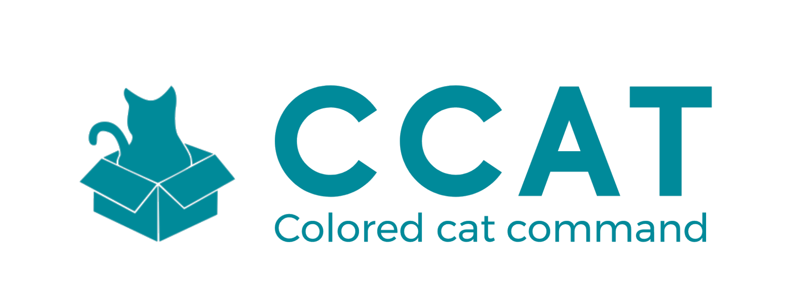
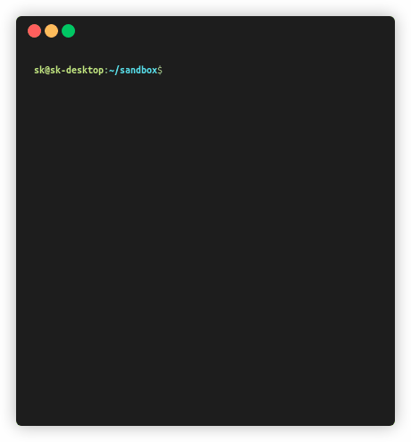
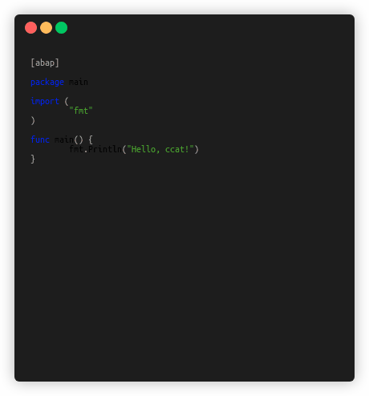

<p align="center">
  <a href="https://github.com/skmatz/ccat">
    
  </a>
</p>

<p align="center">
  <a href="https://github.com/skmatz/ccat/actions?query=workflow%3Abuild">
    
  </a>
  <a href="https://github.com/skmatz/ccat/actions?query=workflow%3Arelease">
    
  </a>
  <a href="./LICENSE">
    
  </a>
  <a href="./go.mod">
    
  </a>
  <a href="https://github.com/skmatz/ccat/releases/latest">
    
  </a>
</p>

<p align="center">
  
</p>

# ccat

**ccat** is the colored `cat` command.

## Install

### Binary

Get binary from [releases](https://github.com/skmatz/ccat/releases).

### Source

```sh
go get github.com/skmatz/ccat
```

## Available Themes

We can use various themes.

- adap
- dracula
- emacs
- github
- monokai (default)
- pygments
- solarized-dark
- solarized-light
- vim
- ... [more](https://github.com/alecthomas/chroma/tree/master/styles)

<p align="center">
  
</p>

Set your favorite theme in `~/.config/ccat.json`.  
When you run `ccat` for the first time, the default configuration will be downloaded automatically.

## Supported Languages

Thanks to [alecthomas/chroma](https://github.com/alecthomas/chroma), almost all languages are supported.
